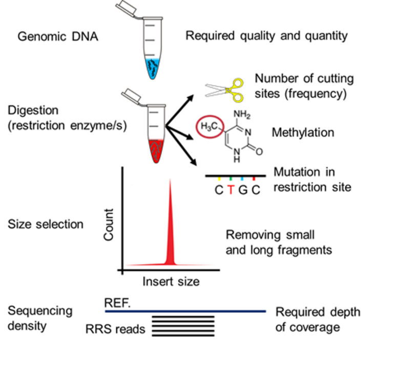
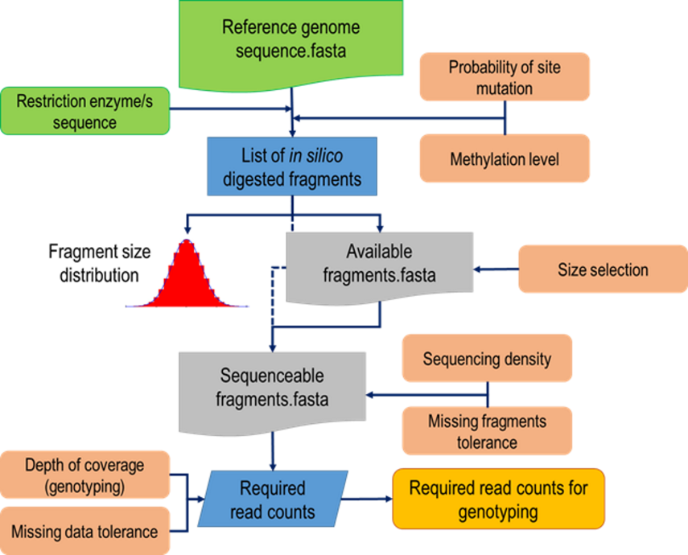

#**DepthFinder**: A Tool to Determine the Optimal Read Depth for Reduced-Representation Sequencing


---

#### Identification of DNA sequence variations such as single nucleotide polymorphisms (SNPs) is a fundamental step towards genetic studies. Reduced-representation sequencing (RRS) methods have been developed to allow for rapid and cost-effective discovery of SNPs and for high-throughput genotyping in a wide range of species. 
#### Despite the huge improvements of the RRS methods in the last decade, the estimation of the number of reads (i.e. read depth) required per sample for an efficient and effective genotyping remains mostly based on trial and error. 

##### Herein we describe a bioinformatics tool, **DepthFinder**, designed to estimate the required read counts for RRS methods.

---

### Citation

Torkamaneh et al. 2019. DepthFinder: A Tool to Determine the Optimal Read Depth for Reduced-Representation Sequencing. Bioinformatics

---
## **Concept**
### Factors that affect the number of restriction fragments in RRS

##### The following biological and technical factors could affect the number of digested fragments in an RRS experiment:

1. Frequency of restriction sites.
2. Accessibility of restriction sites. 
3. Size selection. 
4. Sequencing depth.


**Figure 1** is a schematic representation of the factors which have an impact on RRS libraries.



---

## **DepthFinder**

##### **DepthFinder** is developed under a Linux environment and implemented with standard Python programming language (v3.5) while integrating some shell scripts. It supports multi-threading to take advantage of multi-core computers. *DepthFinder* reads the sequence of one or more **restriction enzyme/s** and an indexed reference genome file and takes a Python library in FASTA format as input. *DepthFinder* accepts single or multiple restriction enzyme combinations (e.g. *Ape*KI or *Pst*I/*Msp*I) as input. After an in silico digestion step, *DepthFinder* reports the predicted digested fragments in FASTA format. In addition, *DepthFinder* reports a frequency distribution of digested fragments based on their size in base pairs. If a restriction enzyme used for digestion is **methylation sensitive**, the methylation level will be taken into account. If the exact level of DNA methylation for a species of interest is not known, approximate [default] values can be applied (e.g. plants 15%, animals 4% and microorganisms 0.01%). An estimation of the number of **base substitutions** that could abolish a restriction recognition site is performed in this program and it is applied by default. In this step, the available fragment sequences are reported in FASTA format. Then, this file is used to perform a **size-selection** step. An interval can be defined for size-selected fragments (e.g. 200 bp - 600 bp) to extract fragments suitable for sequencing based on the NGS instrument used. The proportion of size-selected fragments can be extracted from the frequency distribution file generated in the second step. A negative binomial distribution was used to estimate the required **depth** of [sequencing to achieve a coverage of at least 1x for all digested fragments]. The default value used to achieve this minimum read coverage of 1x is 7, but this can be modified by the user. In this step, an optional value for tolerance towards missing fragments can be applied. Finally, the number of read counts needed to achieve at least 1x coverage of all digested fragments is generated with *DepthFinder*. This represents the number of reads per sample required to achieve 1x coverage of all **sequenceable fragments**. The user can define a desired depth of coverage and tolerance towards missing data. A log file, describing a summary of all these steps is created. *DepthFinder* functions, inputs and outputs are presented in **Figure 2**.



---

## Requirements
* Linux with parallel installed (http://www.gnu.org/software/parallel/)
* Python 3.5 (https://www.python.org/)
* Biopython (https://biopython.org/)
* DepthFinder.py (this distribution)

---

## Implementation

##### To illustrate the usage of DepthFinder, an example of a command line and a description of the fields are presented below.

### Functions 

---

#### ```DepthFinder.py PstI MspI 15 50 1000 7 0 Gmax_275_v2.fasta /home/Soybean 1000 50```
	
#### ```DepthFinder.py |Enzyme combination | Methylation level (%) | Smallest fragment (bp) | Largest fragment (bp) | Sequencing density (x) | Missing fragment tolerance (%) | Reference genome | Output | values for the fragment size distribution```


---

##### This command line comprises nine different fields representing required options for DepthFinder. Fields 2 provide the name of restriction enzymes for start and end points of a digested fragment. In this example the expected restriction fragments will bear a *Pst*I site at the 5' end and a *Msp*I site at the 3' end  and vis versa. For single enzyme digestion, such as *Ape*KI, digestion products are expected to bear *Ape*KI sites at both ends (`ApeKI ApeKI`). For single enzyme digestion followed by a mechanical fragmentation, a restriction enzyme is provided as the start point and the field for the end point is left blank. Field 3 indicates the level of methylation in the studied species, in percent; i.e., 15% means that we estimate that 15% of the restriction sites would not be accessible for digestion due to methylation. Fields 4-5 are the intervals for size selection in base pairs. In this example, we want to capture digested fragments larger than 50 bp and smaller than 1000 bp. Field 6 indicates the desired sequencing density, i.e. the mean depth of coverage needed to ensure that a certain proportion of all sequenceable fragments (defined by the user in the next field) will achieve at least 1x coverage. Field 7 represents the percentage of tolerance for missing fragments. In the example above, we wish to capture all fragments at least once, hence 0% allowance for missing fragments. Field 8 provides a reference genome in FASTA format. Field 9 defines an output directory and name. In this example we also ask to create a file to show the fragment size distribution of 50 to 1000bp. 

---

## License


**DepthFinder** is licensed under the GNU General Public Licence version 3 (GPL3). See the LICENCE file for more details.
